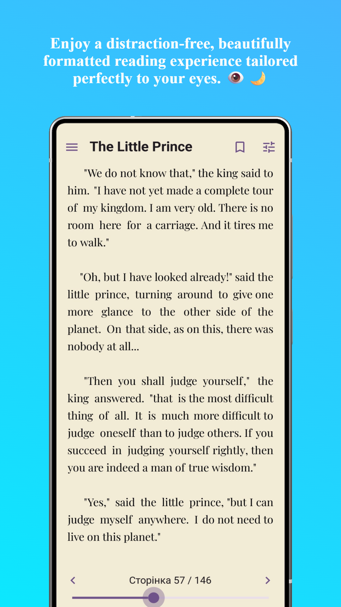
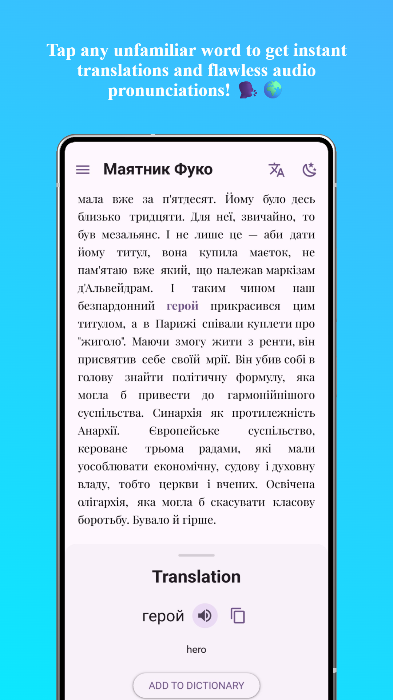
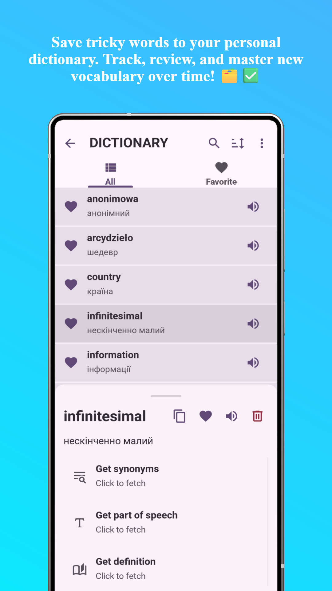
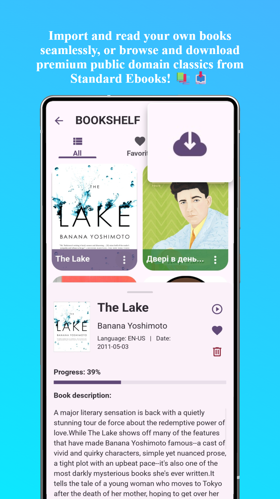
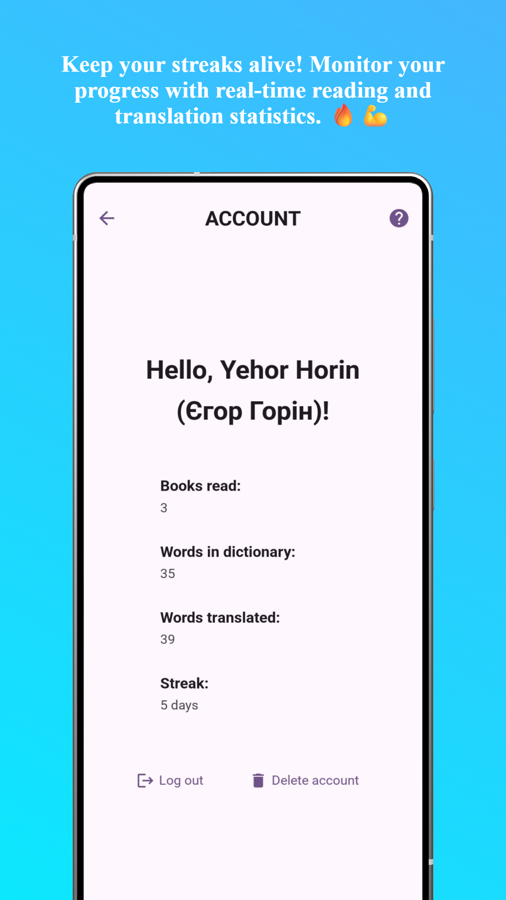
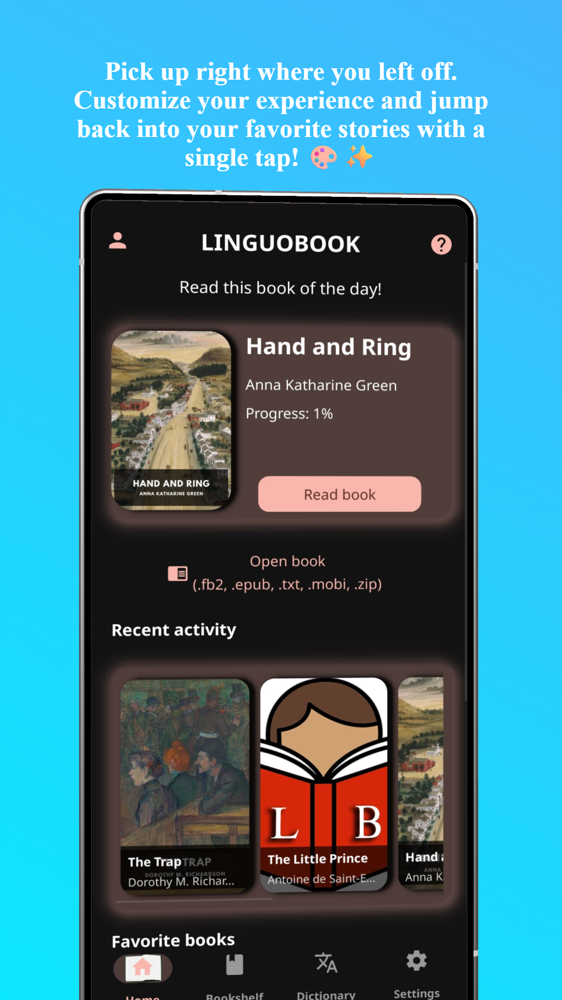

# LinguoBook 📖
### Read, Learn & Expand Your Vocabulary Through E-Books

  <b>The modern, fluid, and intuitive e-reader designed to make learning foreign languages through books effortless.</b>

  

---

## 📱 App Screenshots

  
  
  
  
  
  

---

## 🚀 Key Features

* 📥 **Seamless Book Import:** Instantly open your own files. Full support for `.epub`, `.mobi`, `.fb2`, `.txt`, and `.zip` formats (*`.pdf` support coming soon!*).
* 🌐 **Integrated Standard EBooks Catalog:** Browse and stream public domain classics directly inside the app without downloading files manually.
* 📚 **Dynamic Bookshelf:** Easily organize your collection, view your library at a glance, and track exact reading progress with automated percentage updates.
* 🌍 **Smart Translation & Audio:** Get instant translations between English, Polish, Ukrainian, Czech, German, Spanish, Italian, and French. Features text-to-speech audio to help you master correct pronunciation.
* 📓 **Personal Dictionary:** Never forget a word. Save newly discovered vocabulary directly to your built-in personal dictionary for quick reviews and long-term retention.
* 👤 **User Account & Habit Tracking:** Keep a proud count of finished books, monitor total translated words, and maintain your **Daily Streak** to keep learning momentum alive.
* ⚙️ **Fully Localized Interface:** Navigate comfortably in your preferred language: English, Polish, Ukrainian, or Czech.

---

## 🎯 Who Is LinguoBook For?

* 📖 **Avid Readers:** Book lovers who want to enjoy foreign literature in its original language without constant dictionary-switching friction.
* 🗣️ **Language Learners:** Anyone studying English, Polish, Ukrainian, Czech, German, Spanish, Italian, or French looking to expand their vocabulary naturally in context.
* 🎓 **Students & Self-Learners:** People tired of dry vocabulary lists who prefer acquiring words through engaging stories.
* 📱 **Mobile Readers:** Anyone seeking a clean, modern, and highly responsive e-reader with built-in learning utilities.

---

## ⭐ Why Choose LinguoBook?

* 💡 **Contextual Vocabulary Acquisition:** Learning words inside real sentences and stories makes retention significantly faster and more permanent than flashcards alone.
* ⚡ **All-In-One Solution:** Combines an advanced e-reader, instant multi-language translator, audio pronunciation guide, personal dictionary, and habit tracker into a single app.
* 🆓 **Instant Free Library:** No books? No problem. Access thousands of public domain English classics right from the integrated Standard EBooks catalog.
* 🔥 **Habit-Building Gamification:** Stay motivated every day with daily reading streaks, total word volume tracking, and completed book counters.

---

## 📬 Contact & Support

Have questions, feedback, or need help with your account? We'd love to hear from you!

* **Email Support:** [danedred15@gmail.com](mailto:danedred15@gmail.com)
* **Data Deletion Request:** [Submit Deletion Form](https://docs.google.com/forms/d/e/1FAIpQLScKktmdzTrVjUrzg5CZ3eyS2xAEjyd78-dTEz7vBj0Ourrmyg/viewform?usp=dialog)

---

[Privacy Policy](policy.md) • [Terms of Use](terms.md)

